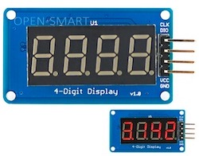

# tm1637.js

[](https://npmjs.org/package/tm1637) [](http://github.com/hughsk/stability-badges)

Control a 4 digit led segments TM1637 driver using javascript and [johnny-five](http://johnny-five.io).



Largely inspired from [raspberrypi-tm1637-4display](https://github.com/thesadabc/raspberrypi-tm1637-4display) and [timwaizenegger/raspberrypi-examples](https://github.com/timwaizenegger/raspberrypi-examples/blob/master/actor-led-7segment-4numbers/tm1637.py).

Tested with a 4 digits, 4 decimal points tm1637 display from catalex.

## Install

`npm i tm1637`

## Usage

```js
const five = require('johnny-five');
const Raspi = require('raspi-io');

const tm1637 = require('tm1637');

const board = new five.Board({
  io: new Raspi()
});

board.on("ready", () => {
  const display = tm1637({
    clk: "GPIO21",
    dio: "GPIO20",
    board: board
  })

  display.show("3.142");

  board.repl.inject({
    display
  });
});
```

 - Pins are [johnny-five compatible pins](http://johnny-five.io/api/pin/)
 - `board` is a [johnny-five board](http://johnny-five.io/api/board/) or any object which support `pinMode`, `digitalRead`, `digitalWrite` methods;

## Related

 - [TM1637 english datasheet](./datasheet-en.pdf)
 - https://github.com/thesadabc/raspberrypi-tm1637-4display
 - https://github.com/timwaizenegger/raspberrypi-examples/blob/master/actor-led-7segment-4numbers/tm1637.py